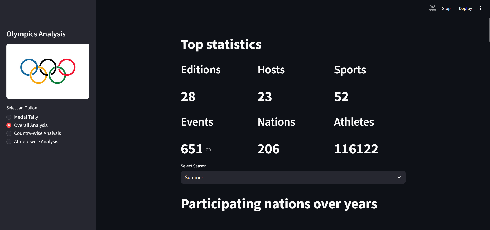
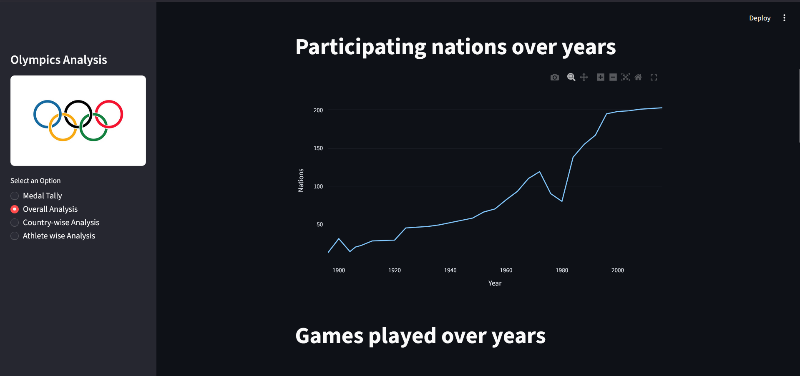
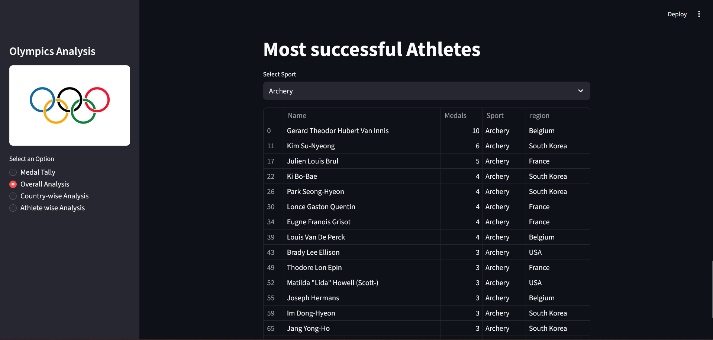
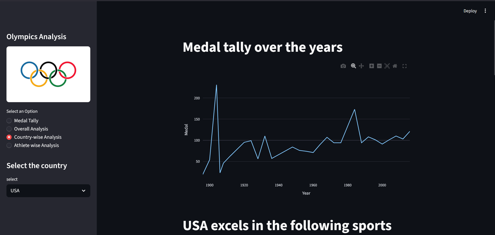
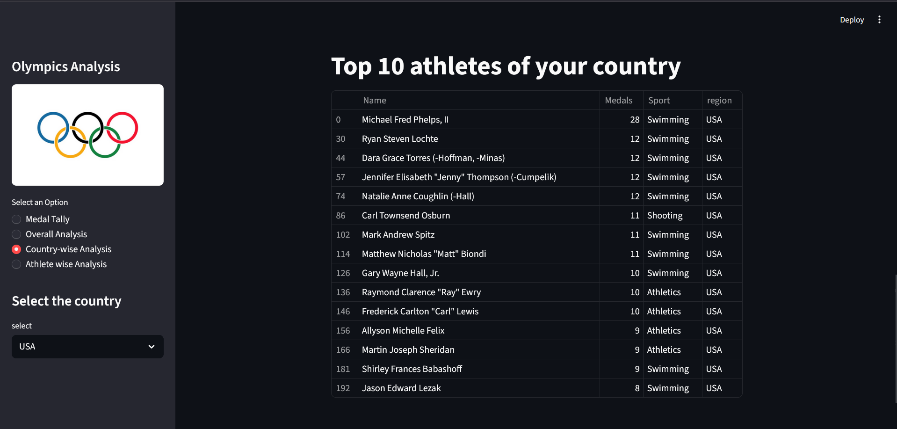
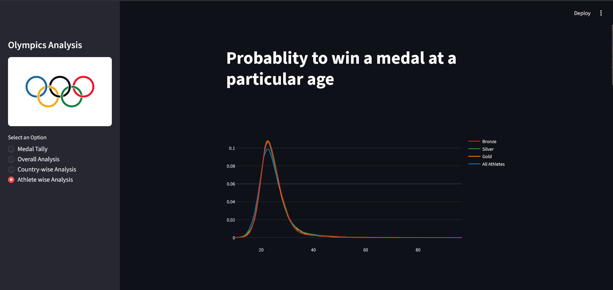
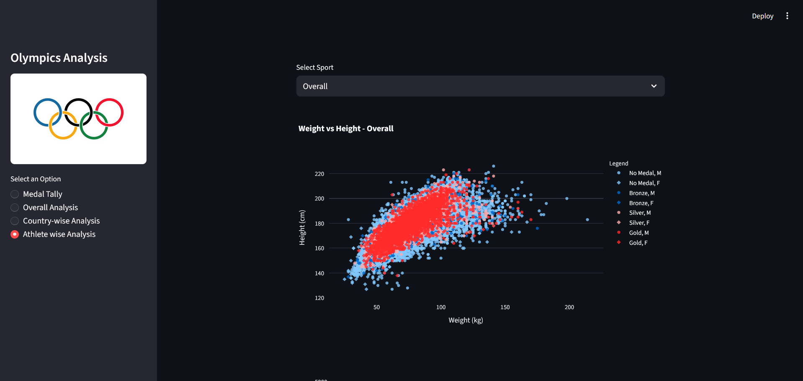

# 🏅 Olympics Data Analysis Dashboard

An **interactive data analytics dashboard** built using **Python and Streamlit** that explores more than **120 years of Olympic Games data**.

The dashboard enables users to analyze medal distributions, athlete statistics, country performances, and historical Olympic trends through interactive visualizations.

---

# 📊 Project Overview

The Olympic Games generate a massive amount of data including information about athletes, countries, sports, and medal results.  

This project performs **Exploratory Data Analysis (EDA)** on the historical Olympic dataset and presents insights through an **interactive Streamlit dashboard**.

Users can explore:

- Medal tallies by country
- Olympic participation growth
- Athlete performance statistics
- Country-wise medal trends
- Athlete physical characteristics

---

# 🚀 Features

### 🥇 Medal Tally
- View medal counts for each country
- Filter by **year**
- Filter by **country**
- Displays **gold, silver, bronze, and total medals**

---

### 📈 Overall Olympic Analysis
Provides global insights such as:

- Total Olympic editions
- Number of participating nations
- Total sports and events
- Athlete participation trends
- Growth of Olympic Games over time

---

### 🌍 Country-wise Analysis
Analyze the performance of individual countries.

Features include:

- Medal tally over the years
- Sports where the country excels
- Top athletes of that country

---

### 🧑 Athlete-wise Analysis
Explore athlete characteristics and performance patterns.

Includes:

- Age distribution of athletes
- Probability of winning medals by age
- Height vs Weight analysis
- Sport-wise physical distributions

---

# 📸 Dashboard Screenshots

## 🥇 Medal Tally

---

## 📈 Overall Analysis

### Top Statistics

### Participating Nations Over Years

### Olympic Games Played Over Time

---

## 🌍 Country-wise Analysis

### Medal Trend Over Years

### Top Athletes of Selected Country

---

## 🧑 Athlete-wise Analysis

### Height vs Weight Analysis

### Age Distribution by Sport

### Probability of Winning a Medal by Age

---

# 📂 Dataset

Dataset used in this project:

**120 Years of Olympic History: Athletes and Results**

Source:  
https://www.kaggle.com/datasets/heesoo37/120-years-of-olympic-history-athletes-and-results

Download the dataset and place the file:
